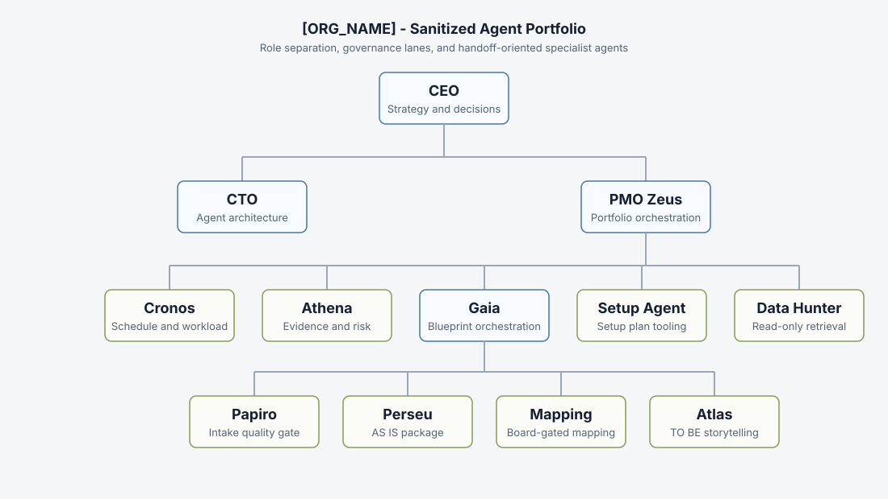

# Pantheon — AI Project Operations

A case study of how I structured specialist agents for project delivery, process discovery, and operational decisions.

The problem behind Pantheon is familiar in project work: schedules, meeting notes, process definitions, and decisions live in different places. A useful analysis needs to connect them, show where its conclusions came from, and recognize when a decision still belongs to a person.

This repository contains a redacted export of that operating model: agent roles, handoff contracts, skill packages, and supporting Python scripts. **It is an architecture case study, not a runnable deployment.**

## Where to start

| If you want to understand... | Start here |
|---|---|
| The problem, my contribution, and the main decisions | [Case study](CASE_STUDY.md) |
| How responsibilities are distributed | [Agent organization](#agent-organization) |
| How a workflow is broken into stages | [Blueprint pipeline](skills/company/TAG_ORG_UNIT/gaia/references/shared/blueprint-pipeline.yaml) |
| How evidence is represented | [Evidence taxonomy](skills/company/TAG_ORG_UNIT/papiro/references/shared/evidence-taxonomy.yaml) |
| What the Python scripts do | [Transcript scanner](skills/company/TAG_ORG_UNIT/TAG_DOMAIN_SETUP_SKILL/scripts/scan_transcricao.py) and [confirmed-segment calculation](skills/company/TAG_ORG_UNIT/TAG_DOMAIN_SETUP_SKILL/scripts/compute_indice.py) |
| What the placeholders mean | [Export notes](README-PORTFOLIO.md) |

The linked implementation files retain redactions. They show the structure of the work, with some details intentionally omitted.

## Agent organization

| Role | Responsibility |
|---|---|
| CEO | Prioritization and escalation |
| CTO | Agent architecture, runtime boundaries, and review discipline |
| PMO / Zeus | Portfolio synthesis and coordination of specialist work |
| Cronos | Schedule, workload, and structural project analysis |
| Athena | Evidence, scope, client risk, and governance review |
| Gaia | Process discovery and blueprint coordination |
| Papiro | Intake completeness and questions about missing information |
| Perseu | AS-IS process structure and gaps |
| Atlas | TO-BE documentation and read-only refinement |
| MappingFromTo | Mapping source concepts to a target vocabulary, subject to human approval |
| Domain setup agent | Setup planning and document generation |
| Query bridge agent | Controlled query interface; stubbed in this export |
| UserDataHunter | Evidence retrieval pattern; redacted in this export |

These are responsibilities in the operating model. The public files do not demonstrate a live group of agents running together.

## What I focused on

- Separate schedule and workload calculations from qualitative risk analysis.
- Make each handoff explicit about inputs, outputs, and unresolved questions.
- Preserve source references instead of presenting every statement as a confirmed fact.
- Keep system access and decision authority explicit, including when human approval is required.
- Use Python for repeatable processing and calculations alongside agent instructions.

The [case study](CASE_STUDY.md) connects these choices to specific files and explains their limits.

## Repository layout

| Path | Contents |
|---|---|
| `agents/` | Role definitions and operating instructions |
| `skills/company/` | Domain workflows, references, schemas, and scripts |
| `skills/paperclipai/` | General platform-related utility packages included in the export |
| `projects/` | Redacted project placeholders |
| `tasks/` | Task definitions included in the export |
| `images/` | Public architecture illustration |

## Public scope

Names, endpoints, credentials, internal paths, and operational details have been removed or replaced in this export. Some source files contain incomplete sentences or configuration values as a result. Restoring a few environment variables is not sufficient to make it a working system.

The repository does not include a reproducible benchmark or verified savings figures. Its purpose is to make the architecture and working approach inspectable.

See the [publication boundaries](LEGAL_AND_PRIVACY_NOTE.md) and [export notes](README-PORTFOLIO.md).

## License

[MIT](LICENSE).
